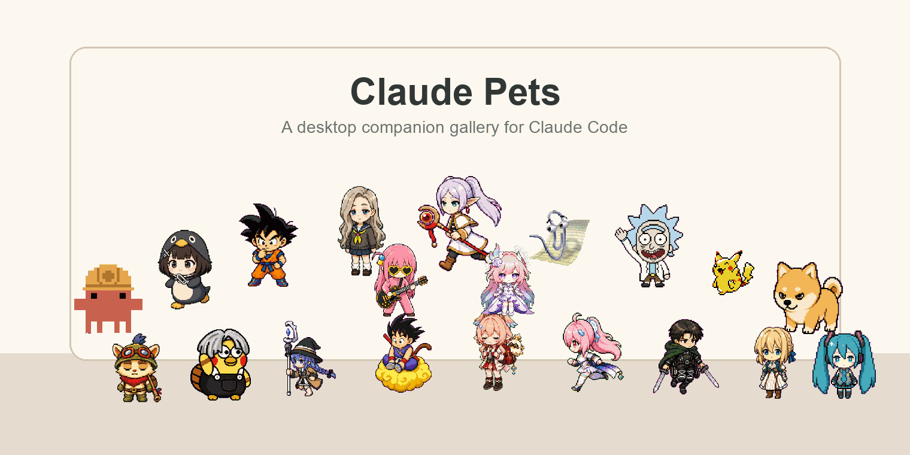
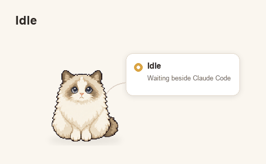
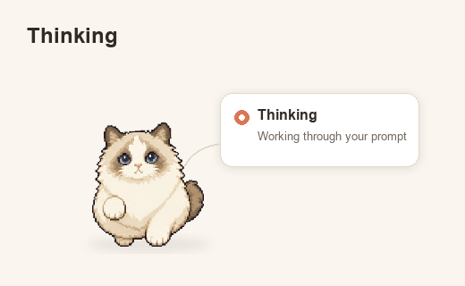
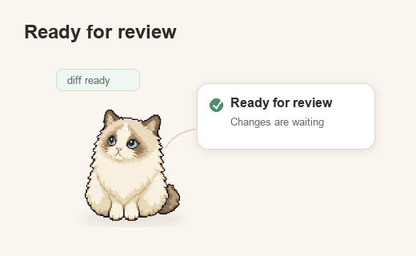
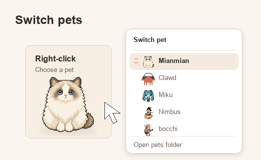

# Claude Pets

<p align="right">
  <a href="./README.md">English</a> | 简体中文
</p>

<p align="center">
  
</p>

<p align="center">
  一个给 Claude Code 用的 macOS 桌面宠物。
  它参考了 Codex Pet 的体验，把类似的桌面陪伴感带到 Claude Code：
  跟随 Agent 状态变化、显示简洁气泡，并在需要权限时让你直接选择 Allow / Deny。
</p>

<p align="center">
  <a href="#快速开始">快速开始</a> ·
  <a href="#添加宠物">添加宠物</a> ·
  <a href="docs/pet-format.md">宠物格式</a> ·
  <a href="docs/troubleshooting.md">排障</a>
</p>

## 演示

<p align="center">
  
</p>

## 它能做什么

- 根据 Claude Code hook 事件切换宠物状态。
- 显示简洁的状态气泡和权限气泡。
- 支持在气泡里处理权限请求：`Allow` / `Deny`。
- 从 `~/.claude/pets` 加载 Codex-compatible 宠物包。
- Codex Pet 可以直接用于 Claude Pets：把宠物包复制到 pets 目录即可。
- 只在本机工作：bridge 监听 `127.0.0.1`。

## 快速开始

需要 macOS、Claude Code，以及 Node.js 22 或更新版本。

```bash
npm install
npm run setup
npm start
```

`npm run setup` 会创建 `~/.claude/pets`，并把 Claude Code hook 命令写入 `~/.claude/settings.json`。
它会保留你已有的 Claude 设置。

## 添加宠物

把一个 Codex-compatible 宠物包复制到 Claude 的宠物目录：

```bash
mkdir -p ~/.claude/pets
cp -R /path/to/<pet-id> ~/.claude/pets/
```

每个宠物目录需要包含：

```text
~/.claude/pets/<pet-id>/
  pet.json
  spritesheet.webp
```

也支持 PNG spritesheet。更多格式说明见 [宠物格式](docs/pet-format.md)。

想找更多宠物，可以去社区宠物市场 [codex-pets.net](https://codex-pets.net/) 下载，然后把宠物文件夹复制到 `~/.claude/pets`。

## 当前状态

Claude Pets 还在早期阶段，目前只支持 macOS。

- 现在主要通过源码运行。
- 不内置、不复制、不同步 Codex 宠物资源。
- 非官方项目，与 Anthropic、OpenAI、Claude Code 或 Codex 无关联。

## 文档

- [宠物格式](docs/pet-format.md)
- [Claude hooks 设置](docs/setup-claude-hooks.md)
- [排障](docs/troubleshooting.md)

## License

License pending.
